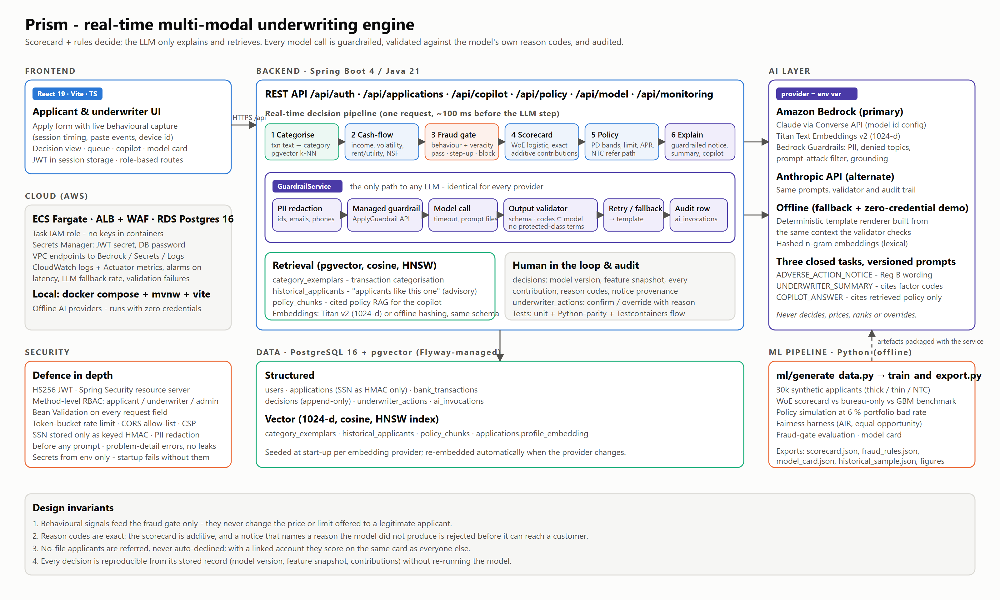

# Prism — Real-Time, Multi-Modal Underwriting Engine

**Goal:** a real-time, multi-modal underwriting engine that expands credit access to New-to-Credit (NTC) and thin-file customers using alternative data and real-time behavioural signals — while catching fraud before pricing and keeping every decision explainable to a regulator.

Prism scores a credit application in about 100 ms from three modalities — bureau data (when it exists), consented bank cash-flow data, and behavioural signals captured while the form is filled in — then explains the decision with **exact, additive reason codes** and a **guardrailed, LLM-rendered notice** that is validated against the model's own factors before a customer can see it.

| | |
|---|---|
| Deck | [`docs/Prism_Underwriting_Engine.pdf`](docs/Prism_Underwriting_Engine.pdf) |
| Architecture | [`docs/architecture.svg`](docs/architecture.svg) · [PNG](docs/figures/architecture.png) |
| Screenshots | [`docs/screenshots/`](docs/screenshots/) |
| API | [`docs/api/openapi.yaml`](docs/api/openapi.yaml) |
| AWS deployment | [`infra/aws/README.md`](infra/aws/README.md) |



## What the prototype shows

- **Cash-flow underwriting that actually reads the statement.** Raw transaction lines ("UBER TECHNOLOGIES DIRECT DEP", "ZELLE TO M PATEL RENT") are categorised by semantic similarity with **pgvector**, then turned into underwriting features: verified income, income volatility, balance trend, rent/utility/phone regularity, obligations, overdrafts, gambling.
- **An interpretable scorecard, benchmarked.** A Weight-of-Evidence logistic scorecard (the model family regulators know) is trained next to a bureau-only baseline and a gradient-boosting ceiling. On the synthetic hold-out: AUC 0.809 vs 0.765 bureau-only; GBM 0.808 — the explainability tax is measurably zero on this data.
- **Approval lift at constant risk.** At a fixed 6% portfolio bad rate, approvals rise from 43.8% to 71.3%; NTC approvals go from **0% (unscoreable) to 73%**, and the swap-in population defaults at 7.4%.
- **Fairness harness on attributes that are never features.** Age adverse-impact ratio moves from 0.45 (bureau-only, fails the 4/5ths rule) to 0.96; the equal-opportunity gap falls from 34% to 3%.
- **A fraud/verification gate that runs before pricing.** Behavioural and device signals can trigger step-up verification or a block but can never change a legitimate applicant's price. 99% block precision, 88% recall of any flag, 0.6% friction on legitimate applicants.
- **Reg B-grade explainability.** Reasons are the largest additive contributions; a no-file applicant gets "no credit bureau file" rather than "score below threshold". The LLM's notice must restate exactly those codes or it is rejected and a deterministic template is issued instead.
- **Provider-agnostic AI layer.** Any OpenAI-compatible endpoint (the demo runs on Groq's free tier with `gpt-oss-120b`; a local Ollama or an in-VPC vLLM is a base-URL change), Amazon Bedrock (Claude via Converse, Titan Embeddings v2, Bedrock Guardrails), the Anthropic API, or a zero-credential offline mode — chosen by an environment variable, never in code. Every provider goes through the same prompts, validator and audit trail.

## Run it locally

Prerequisites: Docker Desktop, Java 21, Node 20+. (Python 3.10+ only if you want to retrain.)

```bash
cp .env.example .env            # set PRISM_DB_PASSWORD, PRISM_JWT_SECRET (>= 32 chars), PRISM_SEED_PASSWORD
docker compose --env-file .env -f infra/docker-compose.yml up -d db      # PostgreSQL 16 + pgvector

# backend (loads the env file, migrates the schema, seeds users, exemplars, policy chunks, historical applicants)
set -a && source .env && set +a && cd backend && ./mvnw spring-boot:run   # Windows: .\mvnw.cmd spring-boot:run after setting the variables

# frontend
cd frontend && npm install && npm run dev                                 # http://localhost:5173 (proxies /api to :8080)
```

The backend is ready once `GET /actuator/health/readiness` returns `UP` (start-up seeding of the vector stores takes a few seconds offline, a few minutes with Bedrock embeddings). Sign in as `applicant`, `underwriter` or `admin` with `PRISM_SEED_PASSWORD` (if you leave it blank, a random password is generated and printed once in the backend log). Load a persona on **Apply** and submit.

Full stack in containers instead: `docker compose --env-file .env -f infra/docker-compose.yml up --build` → http://localhost:8081.

### Turn on a real LLM

| Mode | Set | Needs |
|---|---|---|
| Offline (default) | `PRISM_AI_PROVIDER=offline`, `PRISM_EMBEDDING_PROVIDER=offline` | nothing |
| OpenAI-compatible endpoint (Groq free tier, local Ollama/vLLM, any in-VPC model server) | `PRISM_AI_PROVIDER=openai-compatible`; `PRISM_OPENAI_BASE_URL`, `PRISM_OPENAI_MODEL`, `PRISM_OPENAI_API_KEY_ENV` (defaults: Groq, `openai/gpt-oss-120b`, `GROQ_API_KEY`) | the key named by `PRISM_OPENAI_API_KEY_ENV` (none for a local server) |
| Amazon Bedrock | `PRISM_AI_PROVIDER=bedrock`, `PRISM_EMBEDDING_PROVIDER=bedrock`, `AWS_REGION`, optional `PRISM_BEDROCK_GUARDRAIL_ID` | AWS credentials via `aws configure` / role; model access enabled for Claude and Titan Embeddings v2 in the region |
| Anthropic API | `PRISM_AI_PROVIDER=anthropic` | `ANTHROPIC_API_KEY` |

The decision page shows which provider and model produced each notice and whether it passed validation or fell back to the template. See [`infra/aws/README.md`](infra/aws/README.md) for the Bedrock set-up. The copilot always carries the *Prohibited bases* and *Roles of each component* policy sections in its context, and may name a protected characteristic only while citing that policy (e.g. to refuse an override "because the applicant is young").

### Tests

```bash
cd backend && ./mvnw test        # 34 unit tests + a Testcontainers end-to-end flow (skipped automatically without Docker)
cd frontend && npx tsc -p tsconfig.app.json --noEmit && npm run build
```

Notable tests: `ScorecardEngineTest` proves the Java engine reproduces the Python export's score, PD and reason codes on 300 hold-out rows; `LlmOutputValidatorTest` proves a hallucinated or omitted reason code is rejected; `ApplicationFlowTest` runs login → submit → decision → underwriter summary → copilot against a real pgvector database.

### Retrain the model

```bash
cd ml && pip install -r requirements.txt
python generate_data.py          # 30k synthetic applicants (no real data anywhere)
python train_and_export.py       # trains, evaluates, writes backend/src/main/resources/model/* and docs/figures/*
python personas.py               # regenerates the six demo personas and their statements
```

## Repository layout

```
backend/    Spring Boot 4 (Java 21) — REST API, scoring pipeline, AI layer, security, Flyway schema, tests
frontend/   React 19 + Vite + TypeScript — apply flow, decision view, underwriter queue/copilot, model & fairness page
ml/         Python — synthetic data, scorecard training, benchmark, policy simulation, fairness, fraud-gate evaluation
infra/      docker-compose (pgvector + services), AWS deployment notes, IAM policy, Bedrock Guardrail definition
docs/       deck, architecture diagram, figures, screenshots, OpenAPI description
```

Backend packages: `scoring` (scorecard engine, decision policy), `fraud` (gate), `cashflow` (categoriser + features), `ai` (providers, prompts, redaction, validator, guardrail pipeline, audit), `explain`, `similar`, `knowledge` (policy RAG), `copilot`, `application` (orchestration + API), `auth`, `model`, `monitoring`, `common`.

## How a decision is made

1. **Persist & consent check** — bank transactions are only processed with explicit consent; the SSN is stored only as a keyed HMAC.
2. **Categorise** each transaction description by nearest exemplar in pgvector; **derive** cash-flow features.
3. **Fraud/verification gate** — additive rule points over behavioural and veracity signals → PASS / STEP_UP / BLOCK. Device velocity is computed server-side from applications this system has actually seen.
4. **Score** — WoE scorecard, PD, 600/30/20 scaled score, per-feature contributions, principal reasons.
5. **Policy** — BLOCK → decline; STEP_UP → refer with verification tasks; NTC without bank data → refer with an invitation to link; otherwise PD bands calibrated to a 6% portfolio bad rate; limit = min(requested, multiple of verified income); APR by score tier.
6. **Explain** — the guardrail pipeline renders the applicant notice (and, on demand, the underwriter summary and copilot answers): PII redaction → managed guardrail → model → output validation against the actual reason codes → one corrective retry → deterministic fallback → audit row.
7. **Record** — an append-only decision row with model version, feature snapshot, contributions, reasons and notice provenance.

## Security

Stateless HS256 JWTs (Spring Security resource-server), method-level RBAC, Bean Validation on every field, per-IP token-bucket rate limiting on sensitive endpoints, CORS allow-list, CSP, RFC 9457 problem details with no internals leaked, PII redaction before any prompt, keyed hashing of identifiers, secrets from environment only (start-up fails without them), AWS access via IAM roles in deployment.

## Responsible AI

- The LLM **never decides, prices, ranks or overrides**; it explains, summarises and retrieves from three closed, versioned prompt templates.
- Protected characteristics are never inputs; they are used only in the fairness harness whose results ship in the model card (`/api/model/card`).
- Every decision is reproducible from its stored record; every model call is audited with provider, latency, validation result and fallback flag (`/api/monitoring/summary`).
- Referred cases always reach a person; overrides are recorded with reasons and feed retraining.
- Limitations are stated in the model card: synthetic data, three fairness proxies, a linear-in-WoE model, and prototype stubs for the bureau pull and bank connection.

## Author

Ansh Dixit — personal project, September 2026. Synthetic data only; no real customer information anywhere in this repository.
